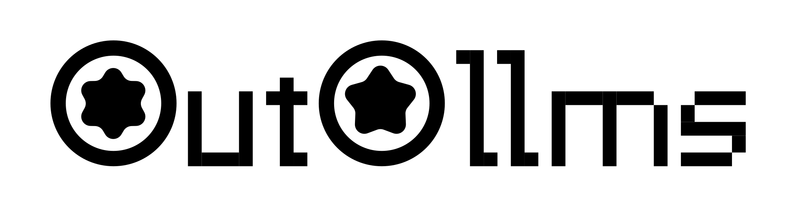

<p align="center">
  
</p>

# outo-llms

Deploy local LLMs behind your own managed, OpenAI-compatible API server.

vLLM or llama.cpp runs in an **isolated environment** managed by outo-llms,
kept apart from the Python environments you already have. Users sign up with a
username and password, receive both an `outo_st_` session token for account
management and an `outo_sk_` API key for inference, organize work into
workspaces, and every request is metered per workspace. Open the built-in web
GUI to sign up or log in, manage workspaces and API keys, and inspect server
status, then point your OpenAI SDK at the URL for an HTTP call.

Full documentation lives in [`docs/`](docs/index.md).

## Principles

1. **Fragmentation** - small, single-purpose modules.
2. **Fluidity** - features can be added or removed as needs change.
3. **Simplicity** - a handful of commands and a small API cover the common workflow.
4. **Automation** - one guided command gets you a working deployment.
5. **Explicitness** - every automated action is announced and logged; the
   system is never touched without your knowledge.

## Features

- **Isolated engine virtualenvs.** vLLM and llama.cpp install into their
  own virtual environments, never into the system interpreter.
- **Choice of engines.** Bring Hugging Face models through vLLM, or GGUF
  models through llama.cpp, and switch between them with one command.
- **Accounts with passwords and sessions.** Signup takes a username and
  password, creates a `default` workspace, and returns both an `outo_st_`
  session token (for management, 14-day expiry) and an `outo_sk_` API key
  (for inference). Login re-issues a session token from the same
  credentials.
- **Per-workspace usage metering.** Token usage is recorded by workspace
  and surfaced at `GET /v1/usage`, with an optional `?workspace=` query
  parameter to scope to one workspace.
- **OpenAI-compatible proxy.** `POST /v1/chat/completions`,
  `POST /v1/completions`, and `GET /v1/models` speak the same shapes
  clients already know. API keys authenticate the inference endpoints;
  session tokens authenticate management and usage.
- **Optional HTTPS.** A local outo-llms CA is created under `data/certs/`
  and signs the server certificate. Setup can install the CA into the
  system trust store so clients trust it without warnings.
- **Explicit automation with an action log.** Every setup step is
  announced, confirmed when destructive, and appended to `actions.log`.
- **Built-in web GUI.** Visit the root URL for signup and login, a read-only
  model catalog, workspace and API-key management, and server status. Visit
  `/docs` for the full OpenAPI explorer.
- **Pre-downloaded weights.** `outo-llms models add` fetches the model's
  weights into the shared Hugging Face cache immediately, so the first
  inference request only has to start the engine instead of downloading
  the model too.

## Install

```bash
uv tool install outo-llms
```

Or with pip / pipx:

```bash
pip install outo-llms
pipx install outo-llms
```

## Quickstart

`outo-llms setup` defaults to a public HTTPS deployment on port `443`:
the API server binds `0.0.0.0:443`, a server certificate signed by the
local outo-llms CA covers the auto-detected server IP, the CA is installed
into the system trust store, and the firewall port is opened on the
supported Linux toolchain. Substitute `<your-server-ip-or-domain>` with
the address printed by `outo-llms status` (the example below uses the
documentation placeholder `203.0.113.10`):

After setup, open `https://<your-server-ip-or-domain>/` in a browser. The
built-in web GUI supports signup and login, shows a read-only model catalog,
manages workspaces and API keys, and reports server status. The API flow below
uses curl instead, and model registration remains CLI-only.

```bash
outo-llms setup                              # interactive, fully explicit setup
curl -s -X POST https://<your-server-ip-or-domain>/v1/account/signup \
  -H 'Content-Type: application/json' \
  -d '{"username": "me", "password": "..."}' # returns api_key + session_token + default workspace
outo-llms models add tinyllama               # register a model and download its weights
curl -s https://<your-server-ip-or-domain>/v1/chat/completions \
  -H "Authorization: Bearer outo_sk_..." \
  -H 'Content-Type: application/json' \
  -d '{"model": "tinyllama", "messages": [{"role": "user", "content": "hi"}]}'
curl -s https://<your-server-ip-or-domain>/v1/usage \
  -H "Authorization: Bearer outo_st_..."    # per-workspace token accounting (session token)
```

The CA installed by setup is trusted on the server itself, so plain
`curl https://...` works there. Other machines need to install
`data/certs/ca.crt` once; until they do, keep `-k`. The setup wizard
prints the exact base URL it configured, the path to the action log, and
writes a short summary you can copy into your shell history.

## Commands

| Command | Purpose |
| --- | --- |
| `outo-llms setup` | Automated, explicit server setup (engine, HTTPS, firewall, launch) |
| `outo-llms models add <name>` | Register a model and download its weights |
| `outo-llms models download <name>` | (Re)download weights for a registered model |
| `outo-llms models list` | Show every registered model |
| `outo-llms models remove <name>` | Unregister a model (asks first) |
| `outo-llms engine list` | List known engines and their installed state |
| `outo-llms engine use <name>` | Switch the active engine (llamacpp or vllm) |
| `outo-llms engine install [name]` | Install an engine into its isolated virtualenv |
| `outo-llms engine status` | Show the active engine's runtime status |
| `outo-llms start` | Start the API server in the background |
| `outo-llms stop` | Stop the background API server |
| `outo-llms restart` | Restart the API server |
| `outo-llms status` | Show server, engine, and path status |
| `outo-llms reset` | Wipe everything back to factory state (asks twice) |
| `outo-llms version` | Print the version |

## How it works

The outo-llms server (`python -m outo_llms.server`) binds `0.0.0.0:443`
with HTTPS by default and exposes an OpenAI-compatible API at
`https://<your-server-ip-or-domain>/`. Engines are internal services that
bind their own loopback ports (llama.cpp on 8612, vLLM on 8613); clients
never reach them directly.

When a request hits `POST /v1/chat/completions` or `POST /v1/completions`,
the server authenticates the caller with the `outo_sk_` API key, looks up
the requested model in the registry, asks the engine manager to ensure the
right engine is running with that model, then forwards the request. The
active engine streams or returns its response unchanged, and the server
records prompt and completion tokens against the calling workspace. Account
and workspace management requests use the `outo_st_` session token from the
same user.

Every state change, install step, and external command goes through
`outo_llms.core.consent`, which announces what is about to happen, asks
for confirmation on destructive actions, and writes a timestamped line to
`logs/actions.log`. The built-in web GUI at the root URL and Swagger UI at
`/docs` round out the picture.

## Documentation

- [`docs/index.md`](docs/index.md) — entry point for installation, API,
  configuration, operations, and testing guides.

## License

Apache License 2.0. See [`LICENSE`](LICENSE).
